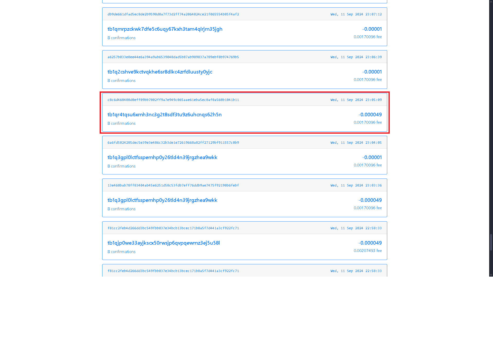
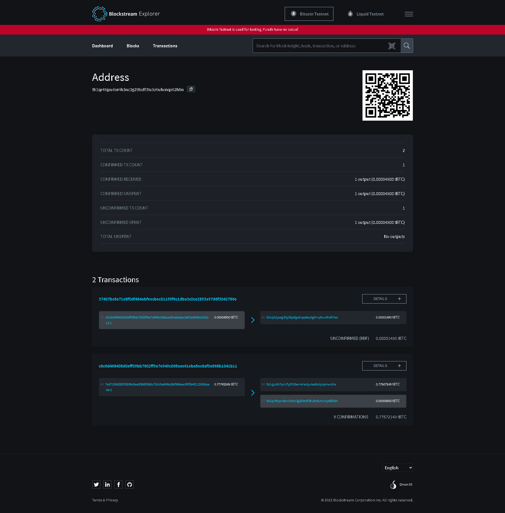

# 🚀 Criando Carteira Bitcoin na Testnet

Este projeto é um guia prático para criar e gerenciar carteiras Bitcoin na **Testnet**, uma rede experimental usada para testes de desenvolvimento. A Testnet permite que os desenvolvedores realizem transações sem precisar gastar moedas reais, usando ferramentas como faucets (distribuidores de Bitcoin "falso"). 
As carteiras são criadas utilizando derivação hierárquica determinísitca e frases de semente mnemonic, além das biblotecas `bip32`, `bip39`, e `bitcoinjs-lib`

## 🛠️ Tecnologias Utilizadas

- **[Node.js](https://nodejs.org/pt)**: Plataforma que permite rodar JavaScript fora do navegador.
- **[JavaScript](https://www.w3schools.com/js/)**: Linguagem de programação leve e interpretada, usada para criar scripts tanto no frontend quanto no backend.
- **[Electrum](https://electrum.org/)**: Uma carteira Bitcoin segura, usada para armazenar e gerenciar suas criptomoedas.
- **[BlockExplorer](https://blockexplorer.one/bitcoin/testnet/address/)**: Explorador de blocos que permite visualizar endereços e transações na blockchain de forma clara e simples.
- **[BlockStream](https://blockstream.info/testnet/address/)**: Explorador alternativo de blocos que permite visualizar endereços e transações na blockchain de forma clara e simples.
- **[Bitcoin Testnet Faucet](https://bitcoinfaucet.uo1.net/)**: Serviço que distribui Bitcoin Testnet gratuitamente para desenvolvedores testarem suas soluções.

## 📋 Como Usar

Siga os passos abaixo para criar sua carteira Bitcoin na Testnet e começar a transacionar:

### 1. Instalação do Node.js

Para rodar scripts em JavaScript fora do navegador, você precisa do Node.js.

### 2. Instalação da Carteira Electrum

Você também precisará de uma carteira Bitcoin para armazenar suas moedas. 

### 3. Desenvolvimento e execução do código JS

```javascript
import * as bip32 from 'bip32';
import * as bip39 from 'bip39';
import * as bitcoin from 'bitcoinjs-lib';

const testnet = {
    messagePrefix: '\x18Bitcoin Signed Message:\n',
    bech32: 'tb',
    bip32: {
        public: 0x043587cf,  
        private: 0x04358394 
    },
    pubKeyHash: 0x6f,      
    scriptHash: 0xc4,     
    wif: 0xef             
};

const path = "m/49'/1'/0'/0"

let mnemonic = bip39.generateMnemonic();
const seed = bip39.mnemonicToSeedSync(mnemonic);

let root = bip32.fromSeed(seed, testnet);

let account = root.derivePath(path);
let node = account.derive(0).derive(0);

let bech32Address  = bitcoin.payments.p2wpkh({
    pubkey: node.publicKey,
    network: testnet,
}).address;

console.log("Endereço: ", bech32Address );
console.log("Chave Privada: ", node.toWIF());
console.log("Seed: ", mnemonic);
```

```yaml
Endereço:  tb1qr4tqsu6xmh3nc3g2t8sdf3tu9z6uhcnqs62h5n
Chave Privada:  a3g1XvxMKcQJKpzULcbScFbAJH33zXvTC4BVzqcZYTQwRdruimGc
Seed:  fury parrot normal night purchase modify conduct abandon omit material ketchup person 
```

### 4. Abertura da Carteira Electrum

Esteja atento aos passos para que ao final, você consiga receber e enviar as moedas.

 1. Abra as propriedades do atalho na sua área de trabalho, e ao final do campo destino, inclua `--testnet`
 2. Execute o programa, escolha qualquer nome e escolha o tipo `Carteira Padrão`.
 3. Marque já possue a seed(semente) de uma carteira e digite a frase obtida anteriormente ao executar o código JS.
 4. Nas `Opções`, marque a `Semente BIP39`.
 5. Na próxima página, no caminho de derivação, coloque o mesmo que está no código. Neste caso é `m/49'/1'/0'/0`

### 5. Solicite as faucets

Acesse o site do Bitcoin Testnet Faucet, e no campo designado, cole o endereço da sua carteira obtida ao executar o código JS



### 6. Observe as transações

Você pode observá-las no Electrum, ao marcar para Exibir endereços. Ele também te envia notificação a cada recebimento/envio
E também pode acessar algum explorador através de algum site como o BlockExplorer ou BlockStream.
**Lembre-se que eles devem estar apontando para a testnet.**



### 5. Enviando as faucets

Por fim, retorne ao Electrum e na aba enviar, digite o valor máximo e cole o endereço de onde você obteve os faucets originalmente.
Neste caso é `tb1qlj64u6fqutr0xue85kl55fx0gt4m4urun25p7q` do **Bitcoin Testnet Faucet**.
Escolha o tipo `estático` de taxa e defina um valor que você tenha saldo suficiente para enviá-las

## ✨ Features

- Gera um mnemonic de 12 palavras para recuperação de carteira.
- Cria uma carteira HD usando a rede Testnet.
- Deriva o endereço público e a chave privada da primeira conta da semente.
- Gera o endereço Bitcoin Testnet, a chave privada (no formato WIF) e a mnemonic seed.