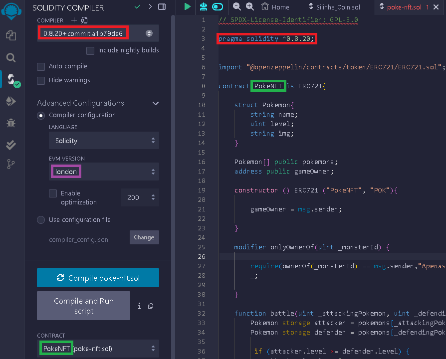
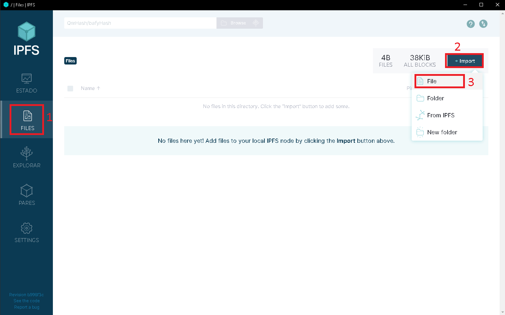
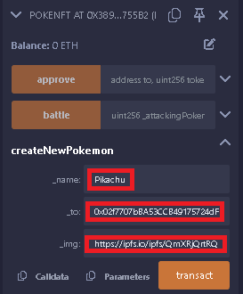
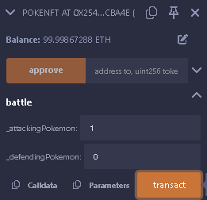
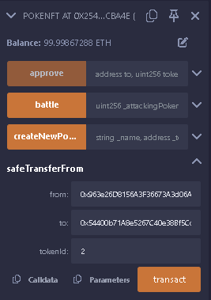

# 🚀 Criando seu próprio Token na Linea Sepolia

Este projeto é um guia prático e acessível de como criar sua própria coleção de NFTs Pokemon em sua blockchain interna através de um smart contract `ERC721`. 
Usando ferramentas como a carteira Metamask, Remix IDE, Ganache e IPFS, você poderá criar sua coleção de NFTs através de `smart contracts` utilizando suas próprias moedas (sem valor real).
Tudo que você precisa é de uma carteira na metamask, desenvolver um código em Solidity através do Remix, criar uma rede blockchain interna com o Ganache e 

## 🛠️ Tecnologias Utilizadas

 - **[Metamask](https://metamask.io/)**: Carteira descentralizada na Web3
 - **[Remix](https://remix.ethereum.org/)**: IDE Online para desenvolver, dubuggar, testar, e fazer o deploy de smart contracts Ethereum e EVMs compatíveis
 - **[Ganache](https://archive.trufflesuite.com/ganache/)**: Blockchain pessoal para o rápido desenvolvimento de aplicativos distribuídos Ethereum e Filecoin
 - **[IPFS](https://github.com/ipfs/ipfs-desktop/releases)**: Armazenamento de arquivos de forma descentralizada
 - **[EIPS](https://eips.ethereum.org/EIPS/eip-721)**: Ethereum Improvement Proposals

---  

## 📋 Como Usar

Supondo que os desafios anteriores foram concluídos, neste passo a passo não irão ser repetidos os processos realizados em desafios anteriores.
São eles: 1) Instalar Ganache e criar a blockchain, 2) Instalar Metamask e importar conta criada no Ganache, 3) Configurar workspace e compilador do Remix, 4)Instalar IPFS.

Os demais passos para a `conclusão do desafio` em questão estarão logo abaixo:

---

## 1. Desenvolver código Solidity

Acesse a IDE Online Remix. Crie um novo arquivo na pasta `contracts`. Neste caso, o arquivo será nomeado como [`poke-nft.sol`](src/code/poke-nft.sol)
Neste novo arquivo, desenvolva um código similar a este:

```sol
/// SPDX-License-Identifier: GPL-3.0

pragma solidity ^0.8.20;

import "@openzeppelin/contracts/token/ERC721/ERC721.sol";

contract PokeNFT is ERC721{

    struct Pokemon{
        string name;
        uint level;
        string img;
    }

    Pokemon[] public pokemons;
    address public gameOwner;

    constructor () ERC721 ("PokeNFT", "POK"){
        gameOwner = msg.sender;
    } 

    modifier onlyOwnerOf(uint _monsterId) {
        require(ownerOf(_monsterId) == msg.sender,"Apenas o dono pode batalhar com este Pokemon");
        _;

    }

    function battle(uint _attackingPokemon, uint _defendingPokemon) public onlyOwnerOf(_attackingPokemon){
        Pokemon storage attacker = pokemons[_attackingPokemon];
        Pokemon storage defender = pokemons[_defendingPokemon];

         if (attacker.level >= defender.level) {
            attacker.level += 2;
            defender.level += 1;
        }else{
            attacker.level += 1;
            defender.level += 2;
        }
    }

    function createNewPokemon(string memory _name, address _to, string memory _img) public {
        require(msg.sender == gameOwner, "Apenas o dono do jogo pode criar novos Pokemons");
        uint id = pokemons.length;
        pokemons.push(Pokemon(_name, 1,_img));
        _safeMint(_to, id);
    }
}
```
**Confira** se a versão do compilador é a mesma do código, e escolha **london** como a versão do EVM em `Configurações Avançadas`
Confira também se o contrato faz referência ao contrato do código e faça o deploy



Na aba de deploy, utilize a opção `Inject Provider - Metamask` no campo de `Environment`.
Faça a compilação do código, e em seguida faça o deploy do mesmo.
Confirme a transação na metamask.

---

## 2. Interagindo com os NFTs

Baixe e instale a versão indicada do IPFS para seu sistema operacional em uso.
Abra o programa e importe os arquivos que serão usados como imagens dos NFTs.



Copie e cole o `share link` de cada um deles em seu block de notas.

### 2.1 Criar um novo Pokemon

Defina um nome para o seu pokemon a ser criado, escolha a carteira para a qual ele será enviado e utilize como imagem o `share link` do respectivo pokemon.



Por fim, aceite a transação na sua metamask.

Para o próximo será necessário repetir este processo, alterando o nome, endereço de carteira e imagem para criar um novo pokemon.

### 2.2 Batalha de Pokemons

Retorne à primeira carteira ou permaneça na mesma. Tenha em mente que o ataque de um pokemon só pode ser feito pela carteira dona deste.
No campo `battle` defina o atacante e o defensor. Lembrando que em uma lista o primeiro elemento começa em zero.



### 2.1 Transferir Pokemons

**OPCIONAL**: Importar duas outras contas do Ganache, criar um novo pokemon, conectar na carteira dona do jogo, criar o novo pokemon e enviá-lo para uma das contas recém importadas.

Conecte ao Remix a conta para qual foi enviado este último pokemon criado, e faça a trasnferência do pokemon desta conta para a outra que também foi importada há pouco.



---

## 3 Explorar transações **OPCIONAL**

Fique livre para explorar através do Ganache as transações realizadas, desde a criação do Contrato, até a criação, batalha e transação dos NFTs.

## ✨ Features

- Desenvolvimento de um smart contract `ERC721` em Solidity na IDE Remix.
- Criação de uma blockchain pessoal no Ganache
- Criação e Transação de NFTs entre contas na rede interna com Metamask
- Armazenamento de imagens para os NFTs de forma descentralizada utilizando IPFS

Agora você pode criar sua própria coleção de NFTs Pokemon na sua própria blockchain! 🎉
