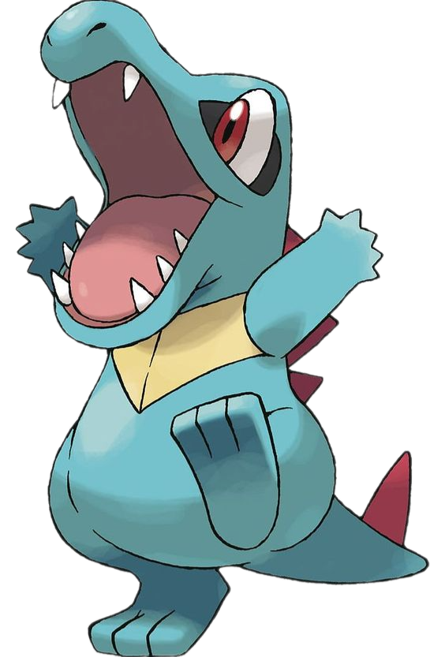
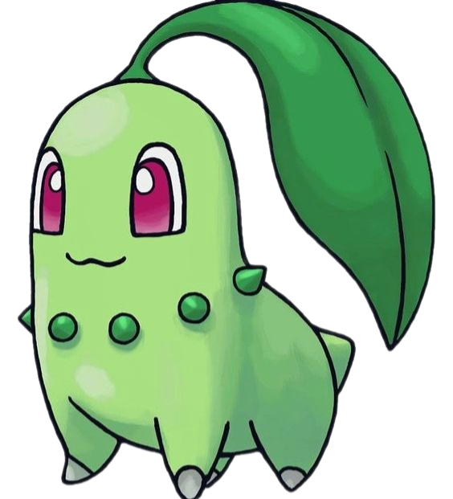
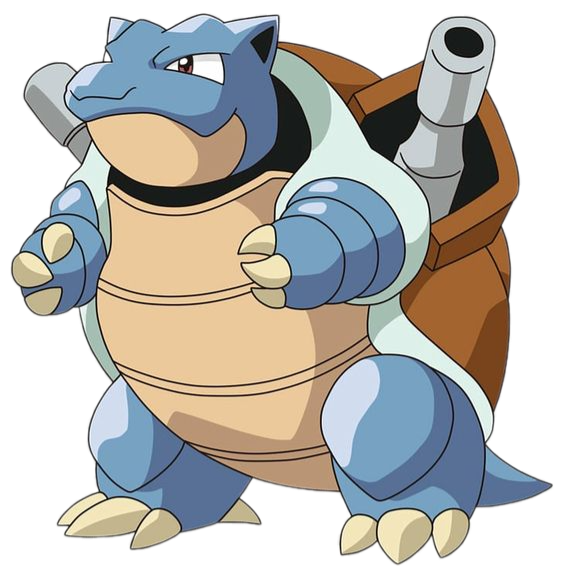
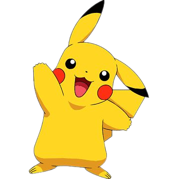
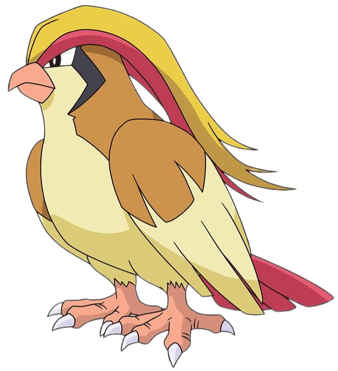

# 🌟 Apresentação de Pokémon Incríveis! 🌟

---

## 🐊 Totodile 

**Nome:** Totodile

💦 Este pequeno crocodilo aquático é pura energia e diversão!

- **Elemento:** 💧 Água
- **Fraquezas:** ⚡ Elétrico, 🌿 Planta

---

## 🍃 Chikorita

**Nome:** Chikorita

🌱 Um adorável Pokémon inicial com uma folha na cabeça e um coração de ouro!

- **Elemento:** 🌿 Planta
- **Fraquezas:** 🔥 Fogo, ❄️ Gelo, 🦅 Voador, 🧪 Venenoso, 🐛 Inseto

---

## 🐢 Blastoise

**Nome:** Blastoise

💪 Uma tartaruga imponente com canhões de água nas costas - o sonho molhado de todo bombeiro!

- **Elemento:** 💧 Água
- **Fraquezas:** ⚡ Elétrico, 🌿 Planta

---

## ⚡ Pikachu

**Nome:** Pikachu

😍 O rato elétrico mais famoso do mundo! Quem não ama essas bochechas vermelhas?

- **Elemento:** ⚡ Elétrico
- **Fraqueza:** 🏔️ Terra

---

## 🦅 Pidgeot

**Nome:** Pidgeot

🌪️ Um pássaro majestoso que voa mais rápido que um jato - perfeito para entregas aéreas!

- **Elemento:** 🐦 Normal/Voador
- **Fraquezas:** ⚡ Elétrico, ❄️ Gelo, 🪨 Pedra

---

## 🎉 Conclusão

Estes Pokémon incríveis mostram a diversidade e criatividade do mundo Pokémon! 
Cada um tem suas forças únicas e fraquezas, tornando as batalhas e aventuras sempre emocionantes! 

Qual deles é o seu favorito? 🤔💖