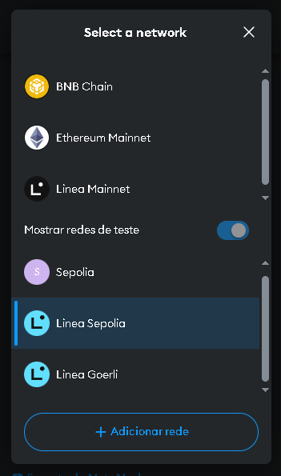
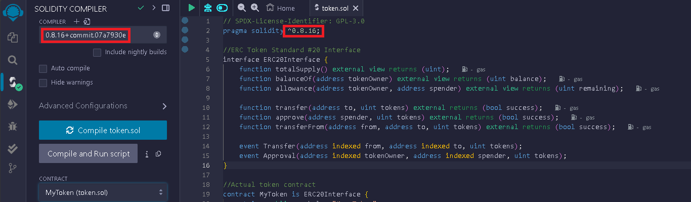
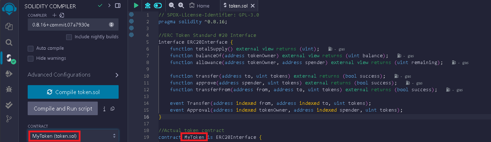
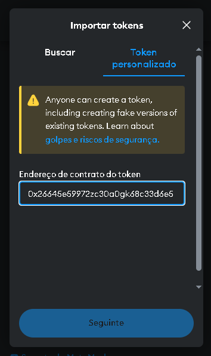

# 🚀 Criando seu próprio Token na Linea Sepolia

Este projeto é um guia prático e acessível de como criar seu próprio token através de um smart contract Ethereum na rede Linea Sepolia. Usando ferramentas como a carteira Metamask e o Remix IDE, você poderá desenvolver e testar seus contratos inteligentes sem gastar moedas reais, utilizando faucets que disponibilizam criptomoedas de teste. 
Tudo que você precisa é de uma carteira na metamask, desenvolver um código em Solidity através do Remix e solicitar alguns faucets para realizar as transações

## 🛠️ Tecnologias Utilizadas

 - **[Metamask](https://metamask.io/)**: Carteira descentralizada na Web3
 - **[Remix](https://remix.ethereum.org/)**: Online IDE para desenvolver, dubuggar, testar, e fazer o deploy de smart contracts Ethereum e EVMs compatíveis
 - **[Infura](https://www.infura.io/faucet/linea)**: Serviço que distribui LineaETH gratuitamente para desenvolvedores testarem suas soluções
 - **[HackQuest](https://www.hackquest.io/en/faucets/59141)**: Serviço alternativo que distribui LineaETH gratuitamente para desenvolvedores testarem suas soluções

---

## 📋 Como Usar

Siga os passos abaixo para criar seus tokens na rede Ethereum e enviá-los para onde quiser:

---

### 1. Criar metamask

Acesse o site oficial e instale a extensão para o seu navegador. 
Fique atento para anotar e salvar em vários locais secretos tanto a seed quanto a chave privada do seu endereço.
Adicione a rede de teste Linea Sepolia



---

### 2. Desenvolver código Solidity

Acesse a IDE Online Remix. Crie um novo espaço de trabalho e um novo arquivo chamado [`token.sol`](src/code/token.sol)
Neste novo arquivo, desenvolva um código similar a este:

```sol
// SPDX-License-Identifier: GPL-3.0
pragma solidity ^0.8.16;  

//ERC Token Standard #20 Interface
interface ERC20Interface {
    function totalSupply() external view returns (uint);
    function balanceOf(address tokenOwner) external view returns (uint balance);
    function allowance(address tokenOwner, address spender) external view returns (uint remaining);

    function transfer(address to, uint tokens) external returns (bool success);
    function approve(address spender, uint tokens) external returns (bool success);
    function transferFrom(address from, address to, uint tokens) external returns (bool success);

    event Transfer(address indexed from, address indexed to, uint tokens);
    event Approval(address indexed tokenOwner, address indexed spender, uint tokens);
}

//Actual token contract 
contract MyToken is ERC20Interface {
    string public symbol = "Meu Token";
    string public name = "Meu Token Coin";
    uint8 public decimals = 2;
    uint256 public _totalSupply;

    mapping(address => uint) balances;
    mapping(address => mapping(address => uint)) allowed;

    constructor() {
        _totalSupply = 1000000;
        balances[msg.sender] = _totalSupply;
    }

    function totalSupply() public override view returns (uint256) {
        return _totalSupply;
    }

    function balanceOf(address tokenOwner) public override view returns (uint256) {
        return balances[tokenOwner];
    }

    function transfer(address to, uint tokens) public override returns (bool success) {
        require(tokens <= balances[msg.sender], "Insufficient balance");

        balances[msg.sender] -= tokens;
        balances[to] += tokens;
        emit Transfer(msg.sender, to, tokens);
        return true;
    }

    function approve(address spender, uint256 tokens) public override returns (bool success) {
        allowed[msg.sender][spender] = tokens;
        emit Approval(msg.sender, spender, tokens);
        return true;
    }

    function allowance(address tokenOwner, address spender) public override view returns (uint remaining) {
        return allowed[tokenOwner][spender];
    }

    function transferFrom(address from, address to, uint256 tokens) public override returns (bool success) {
        require(tokens <= balances[from], "Insufficient balance");
        require(tokens <= allowed[from][msg.sender], "Allowance exceeded");

        balances[from] -= tokens;
        allowed[from][msg.sender] -= tokens;
        balances[to] += tokens;
        emit Transfer(from, to, tokens);
        return true;
    }
}
```
**Confira** se a versão do compilador é a mesma do código

Para facilitar, na aba de deploy, utilize a opção `Inject Provider - Metamask` no campo de `Environment`. Assim, ele irá capturar o endereço exato da sua carteira
Mais abaixo, confira o contrato faz referência ao contrato do código e faça o deploy


Por fim, aceite a transação que aparecerá na sua carteira metamask.

---

### 3. Adicionar o Token à sua carteira

Nesta, na aba `Atividades`, será mostrado o histórico das implementações de contrato. Clique nele e em seguida abra-o no explorador de blocos `Sepolia Linea Scan`:

Copie o endereço do contrato, volte à sua carteira metamask e adicione o endereço copiado para tornar visível o seu token recém criado


---

## ✨ Features

- Criação de uma carteira Metamask compatível com a Web3.
- Desenvolvimento de um smart contract em Solidity na IDE Remix.
- Geração e deploy de um token próprio na rede Linea Sepolia.
- Utilização de faucets para receber LineaETH e realizar transações de teste.

Agora você está pronto para criar e gerenciar seus próprios tokens na rede Ethereum! 🎉