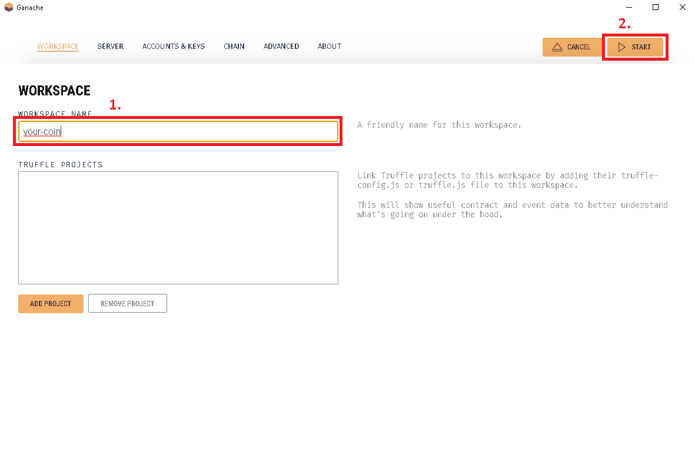
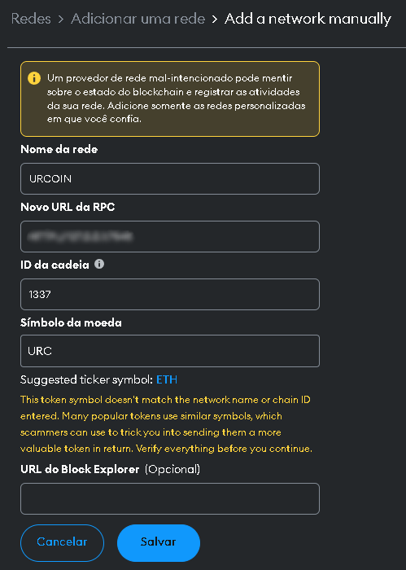
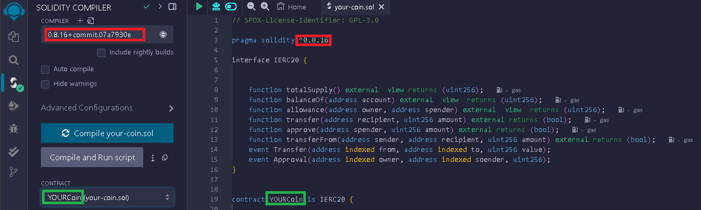
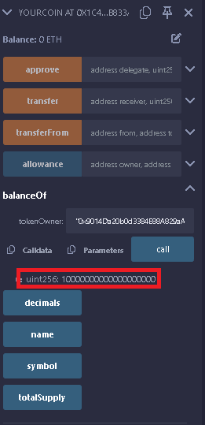
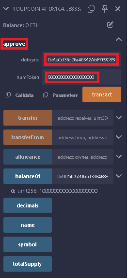
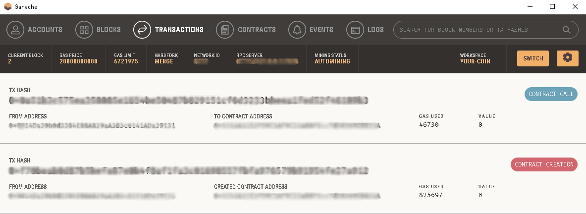
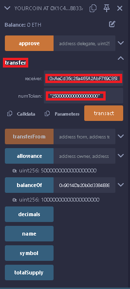
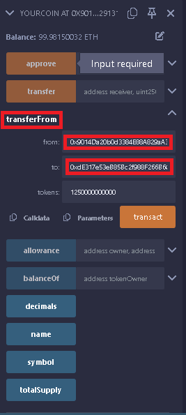
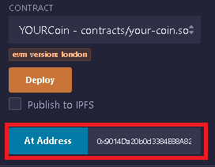

# 🚀 Criando seu próprio Token na Linea Sepolia

Este projeto é um guia prático e acessível de como criar sua própria blockchain através de um smart contract IERC20 na sua própria rede interna. Usando ferramentas como a carteira Metamask, Remix IDE e o Ganache, você poderá desenvolver e testar seus contratos inteligentes utilizando suas próprias moedas (sem valor real).
Tudo que você precisa é de uma carteira na metamask, desenvolver um código em Solidity através do Remix e criar uma rede blockchain interna com o Ganache

## 🛠️ Tecnologias Utilizadas

 - **[Metamask](https://metamask.io/)**: Carteira descentralizada na Web3
 - **[Remix](https://remix.ethereum.org/)**: IDE Online para desenvolver, dubuggar, testar, e fazer o deploy de smart contracts Ethereum e EVMs compatíveis
 - **[Ganache](https://archive.trufflesuite.com/ganache/)**: Blockchain pessoal para o rápido desenvolvimento de aplicativos distribuídos Ethereum e Filecoin

---  

## 📋 Como Usar

Siga os passos abaixo para criar sua blockchain, moeda da sua rede e enviá-las para onde quiser:

---

## 1. Criar rede no Ganache

Acesse o site oficial e instale o programa.
Abra-o e crie um novo espaço de trabalho com o nome que preferir e inicie-o



---

## 2. Adicionar Network

Abra sua metamask e adicione uma rede manualmente.
Insira os dados que façam sentido com o Smart Contract que você irá criar.



 ### 2.1 Importe uma conta da sua blockchain

 Retorne ao Ganache e copie a chave privada de alguma conta (address) que foi gerada
 Abra a Metamask e adicione esta nova conta à sua carteira
 Dica: Modifique o nome da conta para facilitar identificação futura.

---

## 3. Desenvolver código Solidity

Acesse a IDE Online Remix. Crie um novo arquivo na pasta `contracts`. Neste caso, o arquivo será nomeado como [`your-coin.sol`](src/code/your-coin.sol)
Neste novo arquivo, desenvolva um código similar a este:

```sol
// SPDX-License-Identifier: GPL-3.0

pragma solidity ^0.8.16;

interface IERC20 {

    function totalSupply() external  view returns (uint256);
    function balanceOf(address account) external  view  returns (uint256);
    function allowance(address owner, address spender) external  view  returns (uint256);
    function transfer(address recipient, uint256 amount) external returns (bool);
    function approve(address spender, uint256 amount) external returns (bool);
    function transferFrom(address sender, address recipient, uint256 amount) external returns (bool);
    event Transfer(address indexed from, address indexed to, uint256 value);
    event Approval(address indexed owner, address indexed soender, uint256);
}

contract YOURCoin is IERC20 {

    string public constant name = "YOUR Coin";
    string public constant symbol = "URC";
    uint8 public  constant decimals = 18;
    mapping (address => uint256) balances;
    mapping (address => mapping (address => uint256)) allowed;
    uint256 totalSupply_ = 10 ether;

    constructor () {
        balances[msg.sender] = totalSupply_;
    }

    function totalSupply() public override  view returns (uint256) {
        return totalSupply_;
    }

    function balanceOf(address tokenOwner) public override  view returns (uint256) {
        return balances[tokenOwner];
    }

    function transfer(address receiver, uint256 numToken) public override returns (bool) {
        require(numToken <= balances[msg.sender]);
        balances[msg.sender] = balances[msg.sender] - numToken;
        balances[receiver] = balances[receiver] + numToken;
        emit Transfer(msg.sender, receiver, numToken);
        return true;
    }

    function approve(address delegate, uint256 numToken) public  override  returns (bool) {
        allowed[msg.sender] [delegate] = numToken;
        emit Approval(msg.sender, delegate, numToken);
        return true;
    }

    function allowance(address owner, address delegate) public  view override  returns (uint256) {
        return allowed[owner] [delegate];
    }

    function transferFrom(address from, address to, uint256 tokens) public override returns (bool success) {
        require(tokens <= balances[msg.sender]);
        require(tokens <= allowed[from][msg.sender]);

        balances[from] = balances[from] - tokens;
        allowed[from][msg.sender] = allowed[from][msg.sender] - tokens;
        balances[to] = balances[to] + tokens;
        emit Transfer(from, to, tokens);
        return true;
    }
}
```
**Confira** se a versão do compilador é a mesma do código.
Confira também se o contrato faz referência ao contrato do código e faça o deploy



Na aba de deploy, utilize a opção `Inject Provider - Metamask` no campo de `Environment`.
Faça a compilação do código, e em seguida faça o deploy do mesmo.
Confirme a transação na metamask.

---

## 4. Utilizando o Smart Contract na sua rede interna

 ### 4.1 Confira o balanço da conta

 Utilizando o mesmo endereço da conta importada na sua metamask, confira o balanço das moedas disponíveis.

 

  ### 4.1.1 Importe uma conta da sua blockchain

  Retorne ao Ganache e copie a chave privada de alguma **outra** conta (address) que foi gerada
  Abra a Metamask e adicione esta outra nova conta à sua carteira
  Dica: Modifique o nome da conta para facilitar identificação futura.
  Copie o endereço desta segunda conta e retorne à primeira.

  ### 4.1.2 Aprove uma transferência da primeira conta para a segunda conta.

  Com a sua primeira conta conectada ao Remix, delegue a aprovação de uma quantidade de tokens para a segunda conta.

  

  Aceite a transação na sua metamask e confira se a transação foi registrada na sua rede. 
  Você pode conferir na aba `transactions` do Ganache

  

  ### 4.1.3 Faça uma transferência da primeira conta para a segunda conta.

  Ainda com sua primeira conta conectada ao Remix, faça uma transferência de tokens para a segunda conta.

  
  **Utilize um valor inferior ao aprovado anteriormente para evitar erros**

  ### 4.1.4 Faça uma transferência da segunda conta para a terceira conta.

  Alterne na metamask para a segunda conta e conecte ao Remix. Refaça o `Inject Provider` para capturar o endereço desta segunda conta.
  Realize uma transferência utilizando o endereço da primeira conta para o endereço da terceira conta e aprove a transação na metamask.
  Você pode conferir na aba `transactions` do Ganache

  

  **Carregue o endereço do contrato caso seja necessário**
  
  

---

## ✨ Features

- Criação de uma rede própria utilizando Ganache
- Desenvolvimento de um smart contract em Solidity na IDE Remix.
- Geração e deploy de uma moeda próprio na rede interna.
- Realização de transações da moeda criada na rede interna entre diversas carteiras

Agora você pode criar sua própria rede blockchain com sua própria moeda! 🎉
