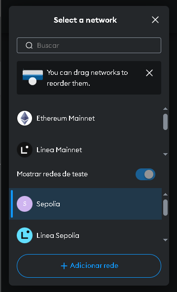
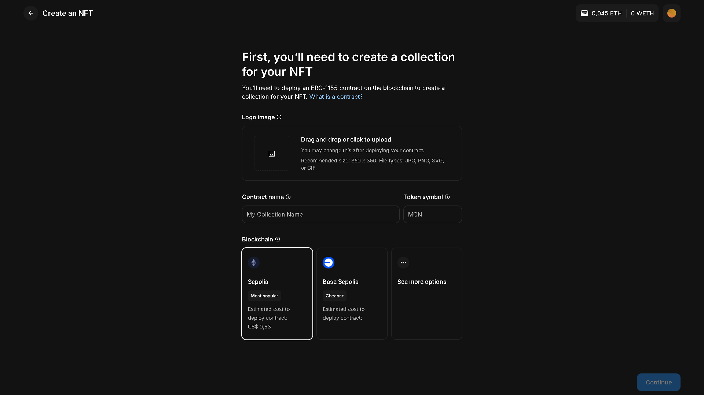
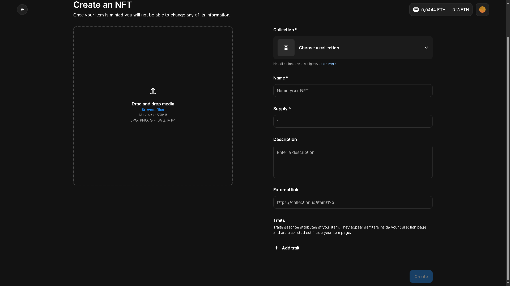
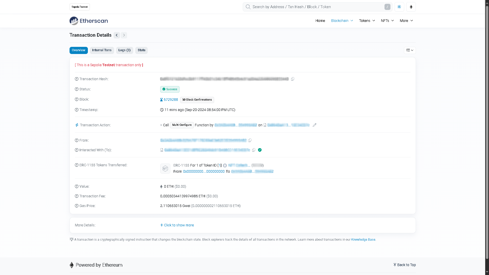
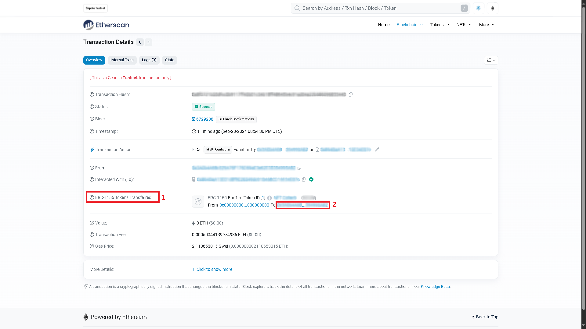

# 🚀 Criando seu próprio NFT na Sepolia

Este projeto é um guia prático e acessível de como criar seu próprio NFT através da Testnet da OpenSea. Serão necessários somente que a carteira Metamask esteja logada na rede Sepolia, e que tenha acesso à testnet da OpenSea.

## 🛠️ Tecnologias Utilizadas

 - **[Metamask](https://metamask.io/)**: Carteira descentralizada na Web3
 - **[OpenSea Testnet](https://testnets.opensea.io/)**: Rede de testes do marketplace de NFTs e criptos coletáveis
 - **[Google Cloud Web3](https://cloud.google.com/application/web3/faucet/ethereum/sepolia)**: Ferramenta, infraestrutura e conhecimento para construir e escalar na Web3.
 - **[Etherscan Sepolia](https://sepolia.etherscan.io/)**: Explorador de blocos e plataforma de análises para Ethereum.

---  

## 📋 Como Usar

Supondo que já tenha concluído os desafios anteriores, terá a sua sua carteira criada e saberá como adquirir faucets.
Siga os passos abaixo para criar seu NFT:

---

## 1. Conecte sua Metamask à rede da Sepolia

Ao ativar as redes de teste, conecte-se à Sepolia

 ### 1.1 Adquira faucets

 Utilize o **Google Cloud Web** para requisitar alguns faucets para a sua carteira conectada à rede Sepolia
  - OBS: Há alguns outros sites que oferecem faucets, mas todos exigem algum tipo de verificação como conta do Twitter, GitHub ou Google. O Google Cloud também necessita, mas não precisará criar uma nova conta para utilizar esses serviço, como em outros sites.
---

## 3. Crie os NFTs

 ### 3.1 Crie a coleção de NFTs

Ao acessar o site da OpenSea, conecte sua metamask e crie uma coleção para guardar seus futuros NFTs

**Preencha** as informações requeridas e escolha a blockchain (deve ser a mesma que você adquiriu os faucets, você vai usá-los como gas fee para a criação do smart contract e dos nfts propriamente).

 ### 3.2 Crie o NFT

 Após confirmada a transação do contrato para criar a coleção, agora é a vez de fazer o mesmo com o NFT.
 Preencha os campos requeridos e crie o NFT pagando o gas fee da transação.
 

---

## 4. Confira as transações e seus NFTs

 ### 4.1 Confira o registro das transações

  Por fim, acesse o `Etherscan Sepolia` e busque pelo endereço da sua carteira. Você verá os hashs de transação tanto dos faucets, como da criação da coleção e do mint do NFT.
  Explore os hashs de transação da coleção e ou do NFT

 

 ### 4.2 Confira a sua coleção de NFTs

  Na OpenSea(**garanta que ainda esteja na Testnet da mesma**) você (ou outras pessoas) pode conferir a coleçaõ de NFTs recém criadas.
  Para tal, vá ao hash de transação da criação do NFT e acesse o endereço do campo `ERC-1155 Tokens Transferred`. Copie o endereço do `Token Contract` e cole no campo de pesquisa da OpenSea
 

---

## ✨ Features
- Criação da coleção de NFTs por meio de um `Smart Contract`
- Mint do NFT utilizando os faucets `SepoliaETH`.

Agora você pode criar sua própria coleção de NFTs! 🎉